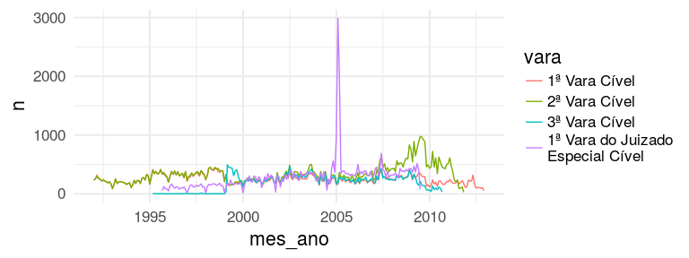

[](https://travis-ci.org/abjur/litigation)

Project Litigation: does income cause litigation?
=================================================

This project organises code for an analysis in association with Max Planck Institute to investigate whether income cause litigation, in an jurimetric/econometric point of view.

Actually, we are waiting to get some data to make the project feasible. For now, we have an exploratory data analysis from Tribunal de Justiça de São Paulo data, made in 2015.

File structure
--------------

This is actually a package, but we don't have any R function.

    .
    ├── data
    │   ├── d_sp_map.rda - shapefile to plot a map of São Paulo
    │   ├── educ.rda - census education data
    │   ├── partes.rda - litigation data: plaintiff address
    │   ├── processos.rda - litigation data: 227,664 cases
    │   └── renda.rda - census income data
    ├── data-raw
    │   ├── raw files and codes to generate analytic data
    ├── DESCRIPTION - package stuff
    ├── LICENSE - package stuff
    ├── litigation.Rproj - package stuff
    ├── man - package stuff
    ├── NAMESPACE - package stuff
    ├── README.Rmd - this file

Installation
------------

This package is not on CRAN (and will never be). To install it, you should run

``` r
# install.packages("devtools")
devtools::install_github("abjur/litigation")
```

Exploratory data analysis
-------------------------

``` r
library(tidyverse)
```

### litigation data

``` r
data(processos, package = 'litigation')
data(partes, package = 'litigation')
```

#### volume by lower court

``` r
prop <- processos %>% 
  count(vara) %>% 
  mutate(prop = n / sum(n),
         prop_txt = paste(round(prop * 100, 2), '%'))
processos %>%
  ggplot(aes(x = vara, fill = vara)) +
  geom_bar() +
  geom_text(aes(y = n, label = prop_txt), 
            data = prop, vjust = -.5) +
  guides(fill = FALSE) +
  scale_y_continuous(limits = c(0, max(prop$n) * 1.1)) +
  theme_minimal(16)
```


#### litigation filing date

-   Lines

``` r
processos %>%
  mutate(mes_ano = as.Date(sprintf('%d-%02d-01',
                                   lubridate::year(dt_distribuicao),
                                   lubridate::month(dt_distribuicao)))) %>%
  count(vara, mes_ano) %>%
  ggplot(aes(x = mes_ano, y = n, colour = vara)) +
  geom_line() +
  theme_minimal(16)
```



-   Stacked

``` r
processos %>%
  mutate(mes_ano = as.Date(sprintf('%d-%02d-01',
                                   lubridate::year(dt_distribuicao),
                                   lubridate::month(dt_distribuicao)))) %>%
  count(vara, mes_ano) %>%
  ggplot(aes(x = mes_ano, y = n, fill = vara)) +
  geom_area(position = 'stack', alpha = .8) +
  theme_minimal(16)
```


-   Proportionally

``` r
processos %>%
  mutate(mes_ano = as.Date(sprintf('%d-%02d-01',
                                   lubridate::year(dt_distribuicao),
                                   lubridate::month(dt_distribuicao)))) %>%
  count(mes_ano, vara) %>%
  group_by(mes_ano) %>% 
  mutate(prop = n / sum(n)) %>%
  ungroup() %>%
  ggplot(aes(x = mes_ano, y = prop, fill = vara)) +
  geom_area(position = 'stack', alpha = .8) +
  theme_minimal(16)
```


#### litigation last movement date

-   Lines

``` r
processos %>%
  mutate(mes_ano = as.Date(sprintf('%d-%02d-01',
                                   lubridate::year(dt_mov),
                                   lubridate::month(dt_mov)))) %>%
  filter(lubridate::year(dt_mov) <= 2014, 
         lubridate::year(dt_mov) >= 2000) %>%
  count(vara, mes_ano) %>%
  ggplot(aes(x = mes_ano, y = n, colour = vara)) +
  geom_line() +
  theme_minimal(16)
```


-   Stacked

``` r
processos %>%
  mutate(mes_ano = as.Date(sprintf('%d-%02d-01',
                                   lubridate::year(dt_mov),
                                   lubridate::month(dt_mov)))) %>%
  filter(lubridate::year(dt_mov) <= 2014, 
         lubridate::year(dt_mov) >= 2000) %>%
  count(vara, mes_ano) %>%
  ggplot(aes(x = mes_ano, y = n, fill = vara)) +
  geom_area(position = 'stack', alpha = .8) +
  theme_minimal(16)
```


-   Proportionally

``` r
processos %>%
  mutate(mes_ano = as.Date(sprintf('%d-%02d-01',
                                   lubridate::year(dt_mov),
                                   lubridate::month(dt_mov)))) %>%
  filter(lubridate::year(dt_mov) <= 2014, 
         lubridate::year(dt_mov) >= 2000) %>%
  count(mes_ano, vara) %>%
  group_by(mes_ano) %>% 
  mutate(prop = n / sum(n)) %>%
  ungroup %>%
  ggplot(aes(x = mes_ano, y = prop, fill = vara)) +
  geom_area(position = 'stack', alpha = .8) +
  theme_minimal(16)
```


#### litigation time

``` r
processos %>%
  filter(!is.na(tempo), tempo > 0, tempo < 3650*2) %>%
  ggplot(aes(x = tempo)) +
  geom_histogram(fill = 'royalblue', alpha = .8, colour = 'black',
                 bins = 30) +
  xlab('time (days)') +
  theme_minimal(16)
```


#### number of litigants by case

The table below shows how many cases have zero, one or more plaintiffs / defendants

``` r
autor_count <- partes %>%
  filter(tipo_parte == 'autor') %>%
  group_by(id) %>%
  summarise(n_autor = n_distinct(id_pessoa)) %>%
  ungroup()

reu_count <- partes %>%
  filter(tipo_parte == 'reu') %>%
  group_by(id) %>%
  summarise(n_reu = n_distinct(id_pessoa)) %>%
  ungroup()

aux1 <- processos %>%
  select(id) %>%
  left_join(autor_count, 'id') %>%
  mutate(n_autor = ifelse(is.na(n_autor), 0, n_autor)) %>%
  count(n_autor)

aux2 <- processos %>%
  select(id) %>%
  left_join(reu_count, 'id') %>%
  mutate(n_reu = ifelse(is.na(n_reu), 0, n_reu)) %>%
  group_by(n_reu) %>%
  summarise(n2 = n())

bind_cols(aux1, aux2) %>%
  select(times = n_autor, autor = n, reu = n2) %>%
  knitr::kable()
```

|  times|   autor|     reu|
|------:|-------:|-------:|
|      0|  121913|  119606|
|      1|  104900|  106131|
|      2|     815|    1852|
|      3|      30|      69|
|      4|       6|       6|

#### litigants State (first 10 ordered by number of plaintiffs)

``` r
partes %>%
  mutate(estado = str_sub(endereco, -2L),
         estado = ifelse(!str_detect(estado, 
                                     '[a-zA-Z]{2}'), '(empty)', estado)) %>%
  count(estado, tipo_parte) %>%
  ungroup %>%
  spread(tipo_parte, n) %>%
  arrange(desc(autor)) %>%
  head(10) %>%
  knitr::kable()
```

| estado  |    autor|      reu|
|:--------|--------:|--------:|
| SP      |  6312911|  2062080|
| PR      |   149824|    21460|
| MG      |    10396|     4655|
| (empty) |     5504|     2172|
| DF      |     2881|     2790|
| RJ      |     1578|     3060|
| SC      |      974|      367|
| PE      |      607|      289|
| GO      |      433|      163|
| RS      |      323|      236|

### Census data

``` r
data(educ, package = 'litigation')
data(renda, package = 'litigation')
data(d_sp_map, package = 'litigation')
```

Empty city map by censitary unit

``` r
d_sp_map %>%
  ggplot() +
  geom_map(aes(x = long, y = lat, map_id = id), map = d_sp_map,
           fill = 'transparent', colour = 'black', size = .08) +
  coord_equal() +
  theme_minimal()
```


#### by education

``` r
d_sp_map %>%
  left_join(educ, c('id' = 'cod')) %>%
  ggplot() +
  geom_map(aes(x = long, y = lat, map_id = id, fill = prop_cat), 
           map = d_sp_map, colour = 'black', size = .05) +
  coord_equal() +
  theme_minimal() +
  ggtitle('Literacy rate')
```


#### by income

``` r
# DomicílioRenda_UF.xls
d_sp_map %>%
  left_join(renda, c('id' = 'cod')) %>%
  ggplot() +
  geom_map(aes(x = long, y = lat, map_id = id, fill = prop_1), map = d_sp_map,
           colour = 'transparent', size = .1) +
  coord_equal() +
  theme_minimal() +
  ggtitle('Less than 1 minimum salary rate')
```


``` r
d_sp_map %>%
  left_join(renda, c('id' = 'cod')) %>%
  ggplot() +
  geom_map(aes(x = long, y = lat, map_id = id, fill = prop_5), map = d_sp_map,
           colour = 'transparent', size = .1) +
  coord_equal() +
  theme_minimal() +
  ggtitle('Between 1 and 5 minimum salaries rate')
```


``` r
d_sp_map %>%
  left_join(renda, c('id' = 'cod')) %>%
  ggplot() +
  geom_map(aes(x = long, y = lat, map_id = id, fill = prop_inf), map = d_sp_map,
           colour = 'transparent', size = .1) +
  coord_equal() +
  theme_minimal() +
  ggtitle('More than 5 minimum salaries rate')
```


Citation
--------

To cite `litigation`, write `citation("litigation")`:

    To cite package ‘litigation’ in publications use:

      Julio Trecenti (2015). litigation: Does Income Cause Litigation Project. R
      package version 0.0.1.9000.

    A BibTeX entry for LaTeX users is

      @Manual{,
        title = {litigation: Does Income Cause Litigation Project},
        author = {Julio Trecenti},
        year = {2015},
        note = {R package version 0.0.1.9000},
      }
